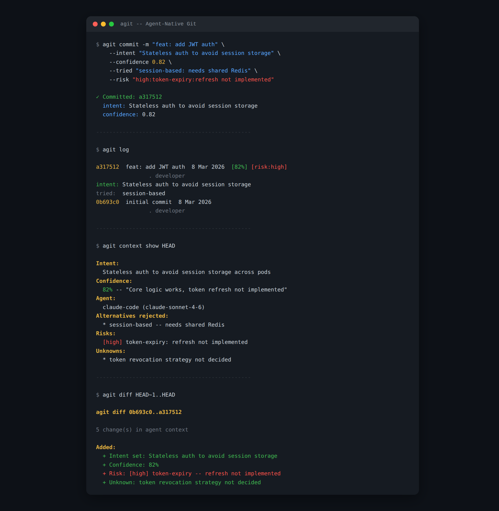
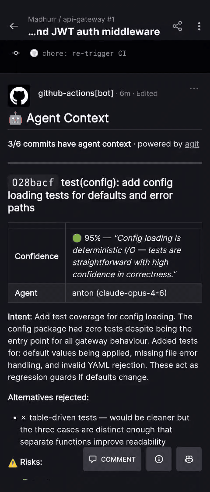

# agit

Git commits tell you *what* changed. agit tells you *why*.





---

`agit commit` wraps `git commit` and stores reasoning in [git notes](https://git-scm.com/docs/git-notes) — intent, confidence, risks, alternatives considered, unknowns. No extra files. No database. Just git.

```bash
agit commit \
  -m "feat: add JWT auth" \
  --intent "stateless auth, no session storage needed across pods" \
  --confidence 0.82 \
  --tried "session-based: needs shared Redis — dropped" \
  --risk "high:token-expiry:refresh path not implemented yet" \
  --unknowns "token revocation strategy not decided"
```

```
$ agit log

a317512  feat: add JWT auth  8 Mar 2026  [82%] [risk:high]
                · dev
intent: stateless auth, no session storage needed across pods
tried:  session-based
```

[](https://golang.org) [](LICENSE)

---

## The problem

AI agents make hundreds of commits. They all look like this:

```
abc1234  feat: add JWT auth
def5678  fix: payment edge case
```

The reasoning behind every decision — why JWT and not sessions, what was tried and rejected, what risks were flagged — vanishes when the session ends. The next agent (or developer) has no context. The next PR reviewer has no idea what they're looking at.

agit stores that reasoning where it belongs: in the repository.

---

## Install

```bash
go install github.com/madhurm/agit@latest
```

Binaries for Linux/macOS/Windows at [releases](https://github.com/Madhurr/agit/releases).

```bash
# one-time setup per repo
agit init
```

---

## Commands

### `agit commit`

```
agit commit -m <message> [flags]

  --intent string              what the agent was trying to do
  --confidence float           0.0–1.0
  --confidence-rationale string
  --tried string               "approach: reason" — repeatable
  --risk string                "severity:area:description" — repeatable
  --unknowns string            repeatable
  --ripple string              files affected but not modified — repeatable
  --agent-id / --agent-model / --session-id
  --json-note string           path to JSON metadata file instead of flags
```

### `agit log`

Commit history with reasoning inline. `--json` for machine-readable output.

### `agit context show [hash]`

Full reasoning for a commit. Defaults to HEAD. `--json` for raw JSON.

### `agit diff [from] [to]`

How reasoning evolved between commits — confidence changes, risks added or resolved, unknowns addressed.

```
$ agit diff HEAD~3..HEAD

Changed:
  Confidence: 68% → 91%

Added:
  + Risk: [medium] race-condition in worker pool

Resolved:
  ✓ Risk resolved: [high] token-expiry
  ✓ Unknown resolved: rollback strategy
```

Supports `agit diff`, `agit diff <hash>`, `agit diff <from>..<to>`.

### `agit init`

Configures the repo to fetch `refs/notes/agit` and carry notes through rebase/cherry-pick.

---

## GitHub PR comments

Add `.github/workflows/agit-pr-context.yml` ([full file](.github/workflows/agit-pr-context.yml)) to any repo. Every PR gets an automatic Agent Context comment — no app registration, no webhooks, no tokens.

---

## How storage works

Notes live in `refs/notes/agit`. Each entry is a JSON blob keyed to a commit SHA.

```
refs/notes/agit
  └── <commit-sha>  →  JSON
```

Push and fetch like any ref:

```bash
git push origin refs/notes/agit
git fetch origin refs/notes/agit:refs/notes/agit
```

Works offline. No vendor dependency. The format is plain JSON and the storage mechanism has been in git since 2010.

---

## Agent integration

Works with any tool that can run shell commands.

```bash
# env vars auto-fill agent metadata
export AGIT_AGENT_ID="claude-code"
export AGIT_MODEL="claude-sonnet-4-6"
```

Drop [AGENTS.md](AGENTS.md) in your repo to tell agents to use `agit commit`.

---

## Status

- [x] `agit commit`
- [x] `agit log`
- [x] `agit context show`
- [x] `agit diff`
- [x] `agit init`
- [x] GitHub Actions workflow for PR comments
- [ ] `agit blame`
- [ ] VS Code extension

---

## License

MIT
